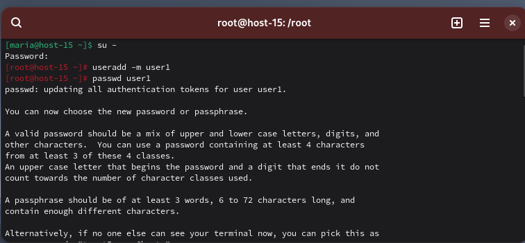

# Управление пользователями

#### 1. Добавьте пользователей user1 и user2: 
1.1) user1 - оболочка bash 
Чтобы добавить пользователя в Линукс, есть спеуиальная команда:
`useradd [список_опций] имя_пользователя`
Но для того, чтобы выполнить эту команду, нужны быть привилегии `sudo`. 

Создадим пользователя user1, чтобы это сделать, с помощью команды `su -` вхожу в систему под суперпользователем. Далее с помощью команды `useradd -m user1` создаю пользователя. Опция -m создает домашний каталог для пользователя по указанному в файле /etc/default/useradd пути. Пользователя мы создали, теперь, как требуется в пункте 1.3 создадим пароль. Для этого используется команда `passwd`. пароль будет `user123`. 



Проверим, что учетная запись была создана с помощью `nano /etc/passwd`

![[../image/Pasted image 20251112005852.png]]

На картинке ниже видно, что user1 расположен в конце файла.

![[../image/Pasted image 20251112005804.png]]

1.2) user2 - оболочка sh 
В целом алгоритм создания тот же. Только при создании указываем `-s /bin/sh` - устанавливаем оболочку входа.

![[../image/Pasted image 20251112011047.png]]

Устанавливаю пароль такой же, user123
Также через `nano /etc/passwd` проверяю создан ли пользователь. В конце файла записано, что `user2` создан через оболочку sh. 
![[../image/Pasted image 20251112011303.png]]

1.3) установите им пароли
    Пароли устанавливались сразу при создании, в пунктах выше указано. Использовала команду `passwd имя_пользователя`
#### 2. Назначьте пользователю 1 группу администраторов, пользователя 2 добавьте в группу пользователя 1

Чтобы управлять пользователями, их основными и дополнительными группами есть утилита usermod. При ее выполнении в терминале нужно указать опции и конкретного пользователя, к которому применяются изменения. -a , --append - опция  добавить пользователя в одну или несколько дополнительных групп. Опция будет работать только вместе с опцией -G. 
-G, --groups - указать список дополнительных групп, в которые должен входить пользователь. Между собой группы разделяются запятой. Если пользователь входит в дополнительную группу, которая не была указана в списке, то он будет из нее удалён. Но при использовании опции **-a** можно добавлять новые дополнительные группы, не удаляя старые.
`usermod -aG wheel user1`. 
Затем с помощью `groups` проверяю текущие группы. wheel - это группа, которая дает права администратора.

![[../image/Pasted image 20251112011601.png]]

Теперь добавим второго пользователя в группу пользователя 1. В целом, это происходит точно также, как я проделала это с user1, однако вместо `wheel` указываю `user1`. Потом с помощью `groups` смотрю, в каких группах сейчас второй пользователь, и вижу, что добавила его в группу юзера 1.

![[../image/Pasted image 20251112012503.png]]

#### 3. Что такое права доступа? Выведите права доступа на файлы в директории пользователя

Права доступа - это система разрешений, которая определяет кто и что может делать с файлами и директориями.

Чтобы вывести права доступа на файлы в домашней директории пользователя, использую `ls -la /home/user1/`

![[../image/Pasted image 20251112013227.png]]

Можно также войти как пользователь и посмотреть `su - user1 -c "ls -la ~/"`.
#### 4. Как изменить права на файлы? Создайте файл который будет на который у всех пользователей будут всевозможные права

Чтобы изменить права на файлы используется `chmod`. Ее синтаксис такой `chmod [кто][оператор][права] файл` кто - это может быть пользователь, может быть группа, могут все, а могут все остальные. Операторы могут быть `+` - добавить права, `-` - убрать права, `=` - установить точно. А права могут быть на чтение, запись или выполнение.

![[../image/Pasted image 20251229202953.png]]

#### 5. Как называется учётная запись встренного администратора в linux?
В Linux учетная запись встроенного администратора называется **root**. Он же суперпользователь. Он обладает неограниченными правами и доступом ко всем файлам, процессам и настройкам системы. Учетная запись имеет UID 0.

Для переключения на нее используется команда `su -` или `sudo -i`.
#### 6. Как выполнить команду от имени администратора?
Для этого используется команла `sudo` - она позволяет 
`sudo команда`

Запуск программы с правами root:

```
sudo имя_программы
```

Sudo запуск от имени другого пользователя:

```
sudo -u имя_пользователя команда
```
выполнить команды от имени суперпользователя (root), также еще есть команда `su` - она похволяет временно переключиться на другого пользователя или стать суперпользователем (root).
`su имя_пользователя`.

Эта команда использует sudo для получения прав root, а затем su для переключения на пользователя root:

```
sudo su
```
#### 7. Есть ли ограничения у суперпользователя?
Суперпользователь имеет максимальные привилегии, но подсистема **control** накладывает ограничения на доступ к командам su и sudo даже для него. root может выполнять любые системные действия, но политики control (wheelonly, restricted) регулируют переход в режим суперпользователя

Control управляет политиками: public (любой пользователь), wheel (группа wheel), wheelonly (только wheel), restricted (только root). По умолчанию su и sudo доступны только членам группы wheel; root проверяет статус командой `control su` или `control sudo`.

Для задания новой политики можно задать `control имя_службы новая_политика`, например:

control sudo restricted

что запретит использовать команду sudo всем, кроме root (а самому root уже в настройках sudo по умолчанию запрещено её использовать).
#### 8. Удалите пользователя 2 с помощью пользователя 1.

Для удаления пользователей используется команда `userdel`.
Команда userdel  удалит пользователя *user2* из системы. 

Чтобы удалить второго пользователя с помощью первого, нужно выполнить команду от первого пользователя: 
`sudo userdel user2`

Если будет дополнительно задан параметр `-d`, то будет уничтожен и домашний каталог пользователя. 

Нельзя удалить пользователя, если в данный момент он еще работает в системе.

![[../image/Pasted image 20251229211759.png]]

#### 9. Как можно изменить владельца папки? измените владельца папки из пункта 4
Владельца папки можно поменять с помощью команды `chown` с правами суперпользователя. 

От первого пользователя выполним команду:

`sudo chown user1:user1 /путь/к/файлу_из_пункта4`

![[../image/Pasted image 20251229212338.png]]

